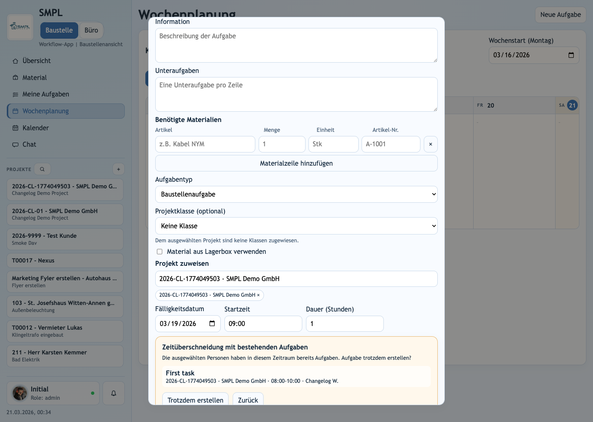
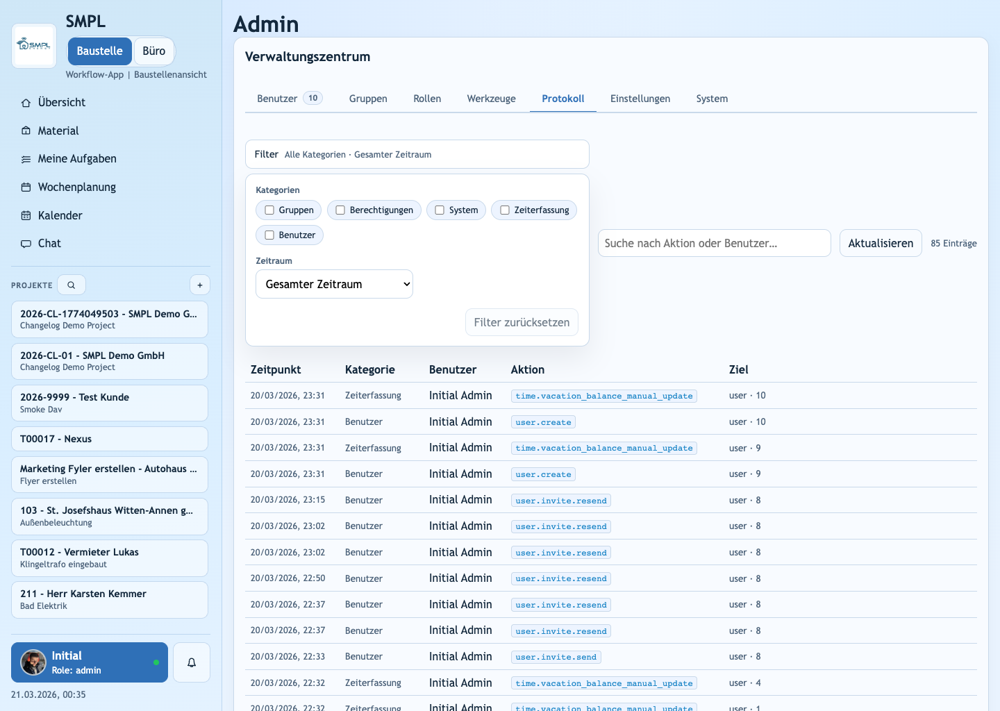
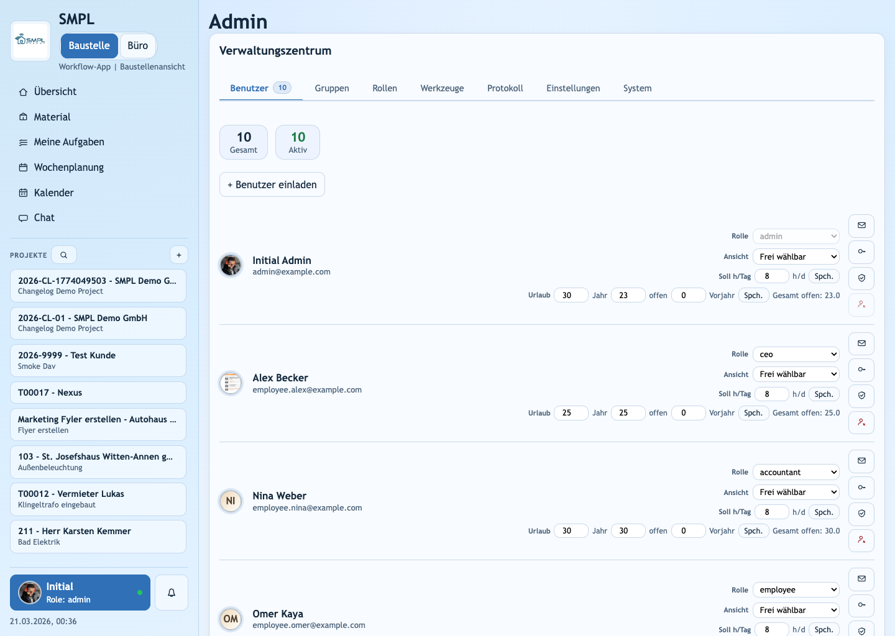
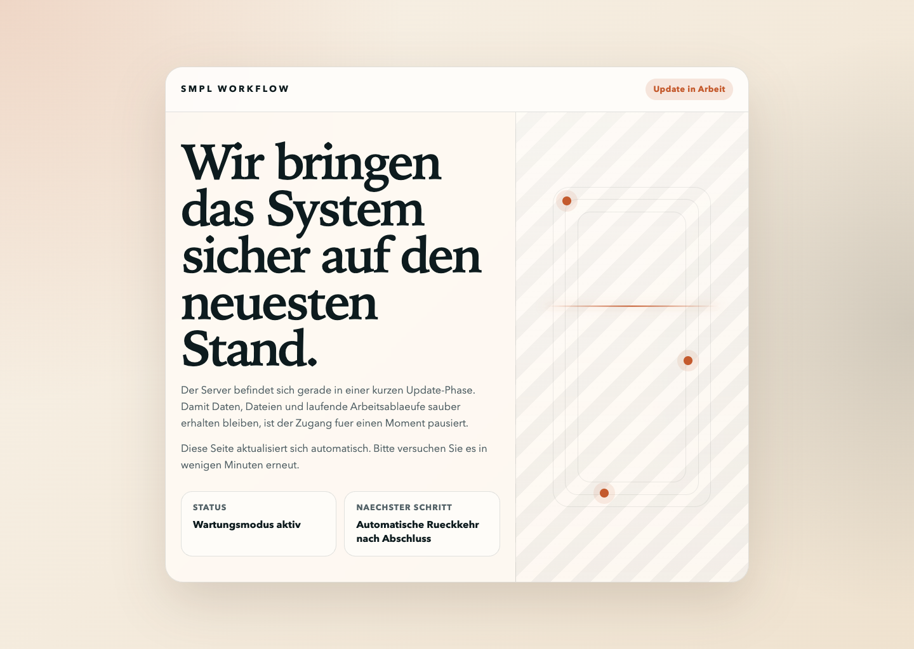

# v1.7.4 (draft) - Scheduling safeguards, admin control cleanup, and safer updates

Date: 2026-03-21

Scope: draft changelog for the unreleased change bundle currently in the worktree after `v1.7.3`.

## Highlights

- Task scheduling now supports explicit durations, derived end times, and server-enforced overlap confirmation.
- Time management now includes tracked vacation balances, carryover handling, absence review state, and limited recent self-edit rights through employee groups.
- The admin center now has clearer permission boundaries, a stronger audit-log filter panel, and runtime SMTP settings for invite/reset delivery.
- Release and update operations are safer: GitHub releases can be published automatically from sanitized archives, and `safe_update.sh` now shows a maintenance landing page instead of transient proxy errors.

## Screenshots

### Task overlap confirmation

The task modal now explains exactly which existing assignment conflicts before a second task is created.

### Audit log filter panel

Audit review moved from split dropdowns to one combined filter surface with category checkboxes and period selection.

### Vacation balance controls in Admin

User management now exposes annual vacation allowance, current available days, carryover, and total remaining days inline.

### Maintenance page during updates

Users now see a controlled maintenance screen while `safe_update.sh` is switching traffic during migrations and rebuilds.

## Detailed changes

### 1. Task scheduling and conflict prevention

- Added nullable `estimated_hours` on tasks via migration `20260319_0039_task_estimated_hours.py`.
- Duration is validated in `0.5` hour increments.
- When `start_time` and `estimated_hours` are both present, the API now derives and returns `end_time`.
- Task create, update, and planning assignment flows now return a structured `409` conflict payload when the same assignee is already occupied in the requested window.
- Conflict detection also checks travel-buffer collisions between back-to-back tasks on different projects when the address-derived travel estimate does not fit in the gap.
- The web app now exposes duration inputs in task create/edit modals and renders inline confirmation UI instead of silently allowing double-booking.
- Calendar, planning, task lists, and ICS exports now use the derived scheduled end time where available.

Example use cases:
- A planner schedules an electrician from `08:00` to `10:00` and gets a warning before assigning the same person again at `09:00`.
- A dispatcher schedules two jobs on different sites back-to-back and gets warned when travel time makes the second start unrealistic.
- Office staff can now read a task as `08:30-10:00` consistently across planning, task lists, and exported calendar entries.

### 2. Time, vacation, and absence management

- Added vacation-balance fields on users:
  - `vacation_days_per_year`
  - `vacation_days_available`
  - `vacation_days_carryover`
  - `vacation_balance_year`
- Added vacation-deduction tracking on requests via `20260319_0042_vacation_request_deduction_tracking.py`.
- Added school-absence review state via `20260320_0043_absence_request_status_and_review.py`.
- Added yearly balance rollover support via `20260320_0044_user_vacation_balance_year.py`.
- `/api/time/current`, `/api/admin/users`, and related schemas now expose full vacation-balance totals, including computed `vacation_days_total_remaining`.
- Admins can edit vacation balances directly from the admin center.
- Approved vacation requests now deduct from carryover first, then current-year available days, and rejected requests restore deducted balance.
- Employee groups can now be flagged with `can_update_recent_own_time_entries`, allowing members to edit only their own most recent entries without granting full time-manager access.

Example use cases:
- An admin can preload a worker with `30` annual days, `18` available days, and `3` carryover days before the worker submits leave.
- A planner approves vacation and the user immediately sees the updated remaining balance in the time view.
- A foreman who should only correct their last few time entries can be placed in a dedicated employee group instead of receiving broad time-management rights.

### 3. Admin center and permission model cleanup

- Permission scope was split more clearly in backend RBAC:
  - `users:manage`
  - `permissions:manage`
  - `settings:manage`
  - `system:manage`
  - `backups:export`
  - `projects:import`
  - `files:view_protected`
- Admin endpoints were updated to use permission-based guards instead of broad admin-only checks where finer control now exists.
- The audit log now stores a `category` field and supports grouped filtering in one panel:
  - multi-select categories,
  - a time-only toggle folded into the same UI,
  - period presets,
  - custom date range.
- Admin SMTP settings were added as runtime-managed settings, so invite/reset delivery can be updated without editing static env files for every sender change.
- Invite/reset links now prefer the forwarded public host when configured base URLs still point at `localhost`, which improves reverse-proxy deployments.
- Admin user rows now show and persist vacation balances inline.
- Employee groups now include the `can_update_recent_own_time_entries` flag.

Example use cases:
- A CEO can keep `system:manage` without necessarily getting every permission-management surface.
- An office admin can filter audit rows to `Zeiterfassung` plus “last 7 days” when reviewing manual balance changes.
- A hosted deployment behind Traefik or another reverse proxy can send invite links with the public domain instead of `https://localhost`.

### 4. Release and update operations

- Added `.github/workflows/release-on-main.yml` to auto-tag and publish the next patch release from `main` when `HEAD` is newer than the latest published release.
- Added `scripts/build_release_bundle.sh` to build release assets from `git archive` and generate a matching SHA-256 checksum.
- Added `.gitattributes` `export-ignore` rules so agent/internal files are not included in archive-based release bundles.
- Added a dedicated maintenance service and static landing page under `infra/maintenance/`.
- Updated `infra/Caddyfile` and `scripts/safe_update.sh` so maintenance mode can be enabled before migrations/rebuilds and removed only after `api` and `web` are healthy again.
- If the update flow fails mid-run, maintenance mode remains active intentionally to avoid exposing a half-updated system.

Example use cases:
- A push to `main` can now publish a sanitized GitHub release tarball without leaking `.claude`, task notes, or agent helper files.
- During `safe_update.sh`, staff now see a clear “update in progress” page instead of browser-facing proxy failures.
- Operators can recover from a failed update deliberately, because traffic stays on the maintenance page until the stack is healthy again.

## Upgrade notes

- Required migrations:
  - `20260319_0039_task_estimated_hours.py`
  - `20260319_0040_group_time_edit_and_audit_categories.py`
  - `20260319_0041_user_vacation_balances.py`
  - `20260319_0042_vacation_request_deduction_tracking.py`
  - `20260320_0043_absence_request_status_and_review.py`
  - `20260320_0044_user_vacation_balance_year.py`
- Apply with:
  - `docker compose run --rm api sh -lc 'cd /app && alembic upgrade head'`
- New GitHub release secret:
  - `RELEASE_TOKEN`
- Optional GitHub release variable:
  - `RELEASE_USERNAME`
- No additional migration is required for the maintenance-mode landing page or SMTP runtime settings.

## Verification snapshot

- Release bundle automation:
  - `bash -n scripts/build_release_bundle.sh`
  - `./scripts/build_release_bundle.sh v1.7.3 dist/SMPL-v1.7.3-worktree.tar.gz`
  - archive exclusion probe: pass
- Scheduling and planning bundle:
  - `cd apps/web && npm run build`: pass
  - `python3 -m compileall apps/api/app apps/api/tests/test_planning.py`: pass
  - Docker pytest for the planning changes was blocked locally because Docker Desktop was paused during that iteration
- Audit and admin UI:
  - `cd apps/web && npm run build`: pass
- Maintenance-mode rollout:
  - `bash -n scripts/safe_update.sh`: pass
  - `docker compose config`: pass
  - `docker compose --profile maintenance config`: pass

## Summary

This draft release is mainly about making scheduling stricter, time administration more explicit, admin permissions less coarse, and deployments safer for real operators. The visible outcome is fewer silent planning mistakes, better leave accounting, a cleaner admin center, and a controlled update experience for end users.
